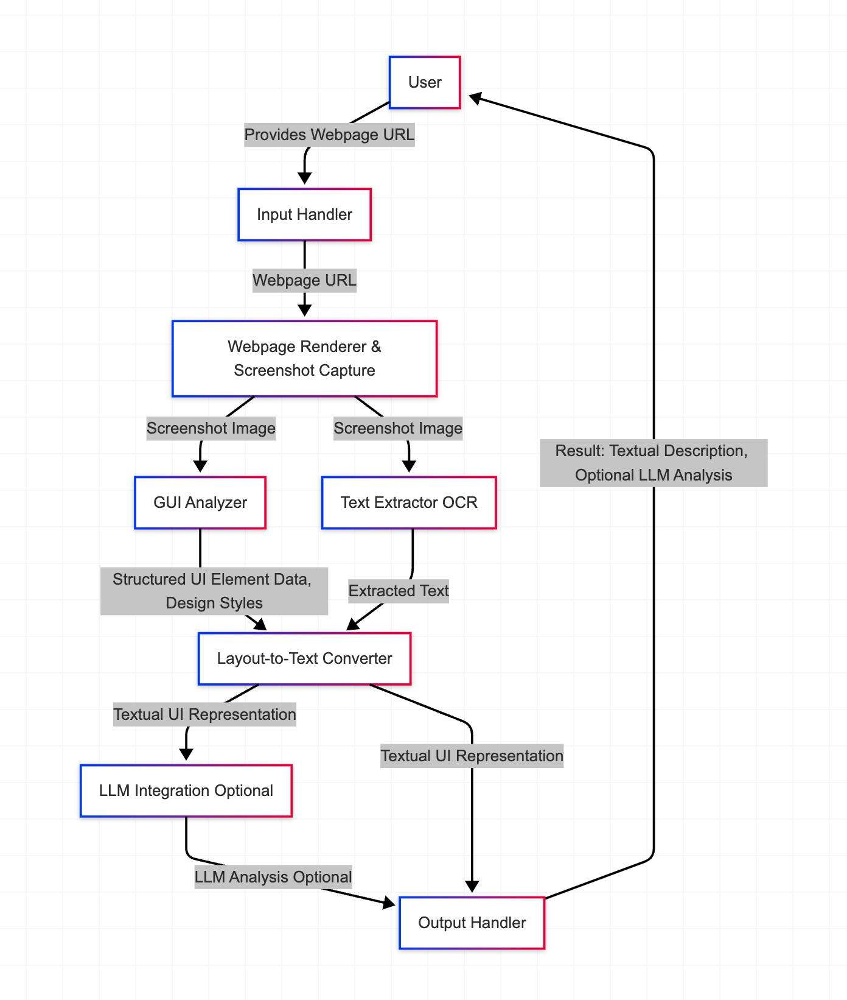

# WebpageDesign-to-Text

A powerful tool that converts webpage designs to structured textual descriptions, enabling UX research, web development, accessibility auditing, and AI/LLM applications.

## Overview

WebpageDesign-to-Text takes a webpage URL as input, renders the webpage, captures a screenshot, analyzes the visual information to detect UI elements and infer design styles, extracts text content, and generates a structured textual representation of the webpage's UI design and layout. This textual output is suitable for analysis by Large Language Models (LLMs) for UX improvement and other purposes.



## Core Features

- **URL to Screenshot**: Render webpages and capture full-page screenshots using headless browser technology
- **OCR Integration**: Extract text content from webpage screenshots with Google Cloud Vision API
- **UI Element Detection**: Identify UI components like buttons, forms, navigation, etc.
- **Design Style Inference**: Analyze color palettes and layout patterns to identify design principles
- **Structured Output**: Generate both structured (JSON) and human-readable (Markdown) descriptions
- **LLM Analysis**: Optional integration with Claude for UX and accessibility insights
- **Flexible Output**: Save results as markdown, JSON, or display in terminal

## General Architecture

The system is composed of several key components:

1. **Input Handler**: Validates and processes webpage URLs
2. **Webpage Renderer & Screenshot Capture**: Renders the webpage using Pyppeteer and captures a screenshot
3. **GUI Analyzer**: Analyzes the screenshot to detect UI elements and infer design styles
4. **Text Extractor (OCR)**: Extracts text content from the screenshot using Google Cloud Vision API
5. **Layout-to-Text Converter**: Generates a textual representation of the webpage from the analysis
6. **LLM Integration (Optional)**: Provides UX and accessibility insights using Claude
7. **Output Handler**: Manages saving and displaying results

### Data Flow

1. User provides a webpage URL
2. System renders the webpage and captures a screenshot
3. The screenshot is analyzed to detect UI elements and text content
4. Analysis is converted into a structured textual description
5. (Optional) LLM analyzes the description for UX and accessibility insights
6. Results are presented to the user and saved as files

## Installation

### Prerequisites

- Python 3.8 or higher
- A Google Cloud account with the Vision API enabled
- An Anthropic API key (for LLM analysis)

### Steps

1. Clone this repository:
   ```
   git clone https://github.com/tonycai/WebpageDesign-to-Text.git
   cd WebpageDesign-to-Text
   ```

2. Install dependencies:
   ```
   pip install -r requirements.txt
   ```

3. Create a configuration file:
   ```
   cp config.yaml.template config.yaml
   ```

4. Edit `config.yaml` to add your Google Cloud credentials and Anthropic API key.

## Deployment

### Local Deployment

Run the tool locally from the command line:

```
python main.py https://example.com
```

### Docker Deployment

You can run the tool in a Docker container using either Docker Compose or the provided shell script:

#### Using docker-run.sh (Recommended)

```bash
# Make the script executable (if needed)
chmod +x docker-run.sh

# Run with a URL
./docker-run.sh https://example.com

# Run with additional flags
./docker-run.sh https://example.com --llm --analysis ux
```

#### Using Docker Compose

1. First, edit `docker-compose.yml` to specify the URL and other options:

```yaml
command: ["https://example.com", "--llm", "--analysis", "ux"]
```

2. Run Docker Compose:

```bash
docker-compose up
```

#### Manual Docker Build and Run

```bash
# Build the image
docker build -t webpage-design-to-text .

# Run the container
docker run -v $(pwd)/output:/app/output \
           -v $(pwd)/screenshot:/app/screenshot \
           -v $(pwd)/config.yaml:/app/config.yaml \
           webpage-design-to-text https://example.com
```

### Cloud Deployment (Future Enhancement)

For scalable processing, deploy as a serverless function or web service:

1. Upload the code to your cloud provider (AWS, GCP, Azure)
2. Configure environment variables for API keys
3. Deploy as a serverless function or containerized service
4. Access via API endpoint or message queue

## Usage

### Basic Usage

Process a webpage and generate a textual description:

```
python main.py https://example.com
```

### Advanced Options

```
python main.py https://example.com --config custom_config.yaml --output results_dir --llm --analysis ux
```

### Command-Line Arguments

- `url`: URL of the webpage to analyze
- `-c`, `--config`: Path to configuration file (default: config.yaml)
- `-o`, `--output`: Output directory for saved files
- `-l`, `--llm`: Enable LLM analysis with Claude
- `-a`, `--analysis`: Type of LLM analysis: general, ux, accessibility, or structure
- `-p`, `--prompt`: Custom prompt for LLM analysis

### Configuration

The `config.yaml` file allows customization of various aspects:

```yaml
# Google Cloud Vision API credentials
google_cloud_credentials: "path/to/your/google-cloud-key.json"

# Anthropic API key
anthropic_api_key: "your_anthropic_api_key_here"

# Output directory
output_dir: "output"

# Screenshot settings
screenshot:
  wait_time: 2
  device: "desktop"
  viewport:
    width: 1920
    height: 1080

# OCR settings
ocr:
  languages: ["en"]
  features:
    - TEXT_DETECTION
    - DOCUMENT_TEXT_DETECTION
```

## Output

The tool generates the following outputs:

1. **Textual Description (Markdown)**: A human-readable description of the webpage's UI elements, layout, and design styles. Example:

   ```markdown
   # Example Website

   This webpage uses a standard-layout design.

   ## Color Palette
   The page primarily uses 5 colors: #ffffff (52%), #f5f5f5 (25%), #0066cc (10%), #333333 (8%), #e60000 (5%)

   ## UI Elements
   ### Header (1)
   - A header in the top left of the page containing 'Example Website'

   ### Navigation Bar (1)
   - A navigation_bar in the top center of the page containing 'Home Products About Contact'
   ```

2. **Structured Description (JSON)**: A structured representation of the UI analysis for programmatic use.

3. **LLM Analysis (Markdown)**: Optional analysis by Claude, providing insights on UX, accessibility, or structure.

## Use Cases

### UX Research

Quickly understand the structure of webpages and identify potential usability issues without manual inspection. Use the generated text with Claude to get UX recommendations.

### Web Development

Get a textual representation of a webpage's UI structure to understand layout in unfamiliar codebases. Use the structured output to automate UI testing or documentation.

### Accessibility Auditing

Identify potential areas for accessibility review and prioritize elements for screen reader testing. The tool helps identify elements that might need proper labeling or navigation support.

### AI/LLM Applications

Convert webpage UIs into structured textual data for training or fine-tuning LLMs for UI-related tasks. The consistent output format makes it ideal for creating training datasets.

## Project Structure

```
WebpageDesign-to-Text/
├── config.yaml.template    # Configuration template
├── main.py                 # Main CLI script
├── Dockerfile              # Docker container definition
├── docker-compose.yml      # Docker Compose configuration
├── docker-run.sh           # Helper script for Docker
├── .dockerignore           # Files to exclude from Docker
├── README.md               # Documentation
├── requirements.txt        # Dependencies
├── src/                    # Source code
│   ├── __init__.py
│   └── components/         # Core components
│       ├── __init__.py
│       ├── input_handler.py
│       ├── webpage_renderer.py
│       ├── ocr_extractor.py
│       ├── gui_analyzer.py
│       ├── layout_to_text_converter.py
│       ├── llm_integration.py
│       └── output_handler.py
├── tests/                  # Unit tests
│   ├── __init__.py
│   └── test_input_handler.py
├── output/                 # Output directory
└── screenshot/             # Screenshot directory
```

## Testing

The project includes comprehensive unit tests for all components. The tests cover all major functionality, including input handling, webpage rendering, OCR extraction, GUI analysis, layout-to-text conversion, LLM integration, and output handling.

### Using Docker (Recommended)

The easiest way to run tests is using the provided Docker test configuration, which automatically generates test reports:

```bash
# Run all tests and generate reports
./docker-test.sh

# Run specific tests
./docker-test.sh tests/test_input_handler.py

# Run with specific options
./docker-test.sh -v tests/test_gui_analyzer.py::test_extract_color_palette
```

### Using Docker Compose

```bash
# Run all tests with full reports
docker-compose run test

# Run specific tests
docker-compose run test pytest -v tests/test_input_handler.py
```

### Without Docker

```bash
# Install test dependencies
pip install -r requirements.txt

# Run all tests
pytest -v --cov=src

# Run specific tests
pytest -v tests/test_input_handler.py
```

### Test Reports

When running tests with the Docker script or Docker Compose, several reports are automatically generated:

1. **HTML Test Report**: A detailed report of all test results
   - Location: `test_reports/test_report.html`

2. **HTML Coverage Report**: Interactive coverage report showing which lines of code were tested
   - Location: `test_reports/coverage/index.html`

3. **XML Coverage Report**: Coverage data in machine-readable format for CI/CD integration
   - Location: `test_reports/coverage.xml`

4. **JUnit XML Report**: Standardized test results for CI/CD integration
   - Location: `test_reports/junit.xml`

### PDF Report Generation

You can convert the HTML reports to PDF format for easy sharing:

```bash
# Generate PDF reports from HTML reports
./generate_pdf_report.sh
```

This will create:
- `test_reports/test_report.pdf`: PDF version of the test report
- `test_reports/coverage_report.pdf`: PDF version of the coverage report

Note: This requires `wkhtmltopdf` to be installed on your system.


### Development Workflow

1. Fork the repository
2. Create a feature branch
3. Make your changes
4. Write tests for your changes
5. Run the test suite: `./docker-test.sh`
6. Submit a pull request

## Contributing

Contributions are welcome! Please feel free to submit a Pull Request.

### Feedback and Support

Have suggestions or need help? Feel free to reach out:

- **Telegram**: [@tonyironreal](https://t.me/tonyironreal) - Send your feature requests or report issues
- **GitHub Issues**: For bug reports and feature requests

## Donations

If you find this project helpful and would like to support its development, you can donate cryptocurrency to the following addresses:

- **Solana (SOL)**: `ESUpLq9tCo1bmauWoN1rgNiYwwr5K587h15SrJz9L7ct` (Phantom Wallet)

Your support is greatly appreciated and helps maintain and improve this project!

## License

This project is licensed under the MIT License - see the LICENSE file for details.
